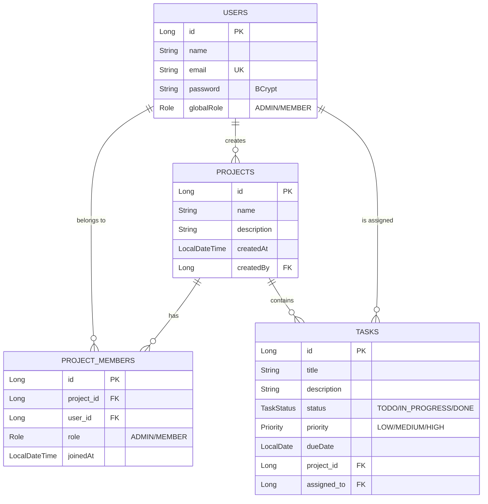

# <p align="center">🚀 Task Manager API</p>

<p align="center">
  
  
  
  
  
</p>

<p align="center">
  🌐 <b>Live API Base URL</b>: <a href="https://task-manager-production-7681.up.railway.app/">https://task-manager-production-7681.up.railway.app/</a>
</p>

### 🔑 Demo Credentials (for testing the live API)
- **Admin**: `admin@taskmanager.com` | Password: `password`
- **Member**: `member@taskmanager.com` | Password: `password`

---

## 📝 Description

**Ethara AI Task Manager** is a high-performance, secure, and scalable RESTful API designed for modern project management workflows. Built with **Spring Boot 3.4** and **Java 21**, it provides a seamless backend for team collaboration, enabling hierarchical task management, role-based access control, and real-time project analytics.

---

## 📋 Table of Contents

- [✨ Key Features](#-key-features)
- [🛠️ Tech Stack & Architecture](#️-tech-stack--architecture)
- [📊 Database Schema](#-database-schema)
- [🔐 Security Flow](#-security-flow-jwt)
- [📂 Project Structure](#-project-structure)
- [🚀 Getting Started](#-getting-started)
- [📖 API Documentation](#-api-documentation)
- [🚢 Deployment (CI/CD)](#-deployment-cicd)
- [⚠️ Error Handling](#️-error-handling)
- [🧪 Testing](#-testing)
- [💡 Future Roadmap](#-future-roadmap)

---

## ✨ Key Features

- 🔐 **Secure Authentication**: JWT-based stateless authentication with secure login and registration.
- 📁 **Project Workspace**: Dedicated workspaces for projects with creator-ownership logic.
- 👥 **Team Management**: Invite members, assign roles (ADMIN/MEMBER), and manage project access.
- 📋 **Advanced Task Tracking**:
  - **Prioritization**: High, Medium, and Low levels.
  - **Status Lifecycle**: Track tasks from `TODO` to `DONE`.
  - **Assignments**: Assign specific tasks to project members.
  - **Deadlines**: Integrated due-date tracking.
- 📊 **Insightful Dashboard**: Get an overview of project health, pending tasks, and overdue items.
- 🔍 **Real-time Search**: Quick user lookup for seamless collaboration.
- 🛡️ **Fail-safe Design**: Comprehensive validation and standardized error responses.

---

## 🛠️ Tech Stack & Architecture

### Backend Core
- **Java 21**: Utilizing modern language features like Records and Pattern Matching.
- **Spring Boot 3.4**: High-speed REST implementation.
- **Spring Security**: Robust JWT authentication and Method-Level Security.
- **Hibernate / JPA**: Powerful ORM for PostgreSQL integration.
- **SpringDoc OpenAPI**: Interactive Swagger UI for developers.

### Architecture Highlights
> [!NOTE]
> We follow a **Domain-Driven Design (DDD)** inspired structure using the **Controller-Service-Repository** pattern.

- **Immutability**: All DTOs are implemented as **Java Records** to ensure data integrity.
- **Standardized Envelope**: Every response is wrapped in a consistent `ApiResponse<T>` object.
- **Bidirectional Persistence**: Optimized JPA relationships with cascade support for seamless project/member creation.

---

## 📊 Database Schema



---

## 🔐 Security Flow (JWT)

1.  **Auth**: User logins via `/api/auth/login`.
2.  **Token Generation**: Server signs a JWT with a 24h expiration and returns it.
3.  **Client Storage**: Client includes the token in the `Authorization: Bearer <token>` header.
4.  **Verification**: `JwtAuthFilter` extracts the token, validates the signature, and populates `SecurityContext`.
5.  **Audit**: Every request is audited for membership permissions in the Service layer.

---

## 📂 Project Structure

```bash
src/main/java/com/adnanumar/task_manager/
├── config/             # Configuration (CORS, Swagger)
├── controller/         # API Layer (Entry points)
├── dto/                # Data Transfer (Immutable Records)
│   ├── request/        # Inbound Validation Payloads
│   └── response/       # Outbound Standardized Envelopes
├── entity/             # Persistence Model (JPA)
├── enums/              # Application Constants
├── error/              # Centralized Error Handling
├── repository/         # Data Access Layer
├── security/           # JWT Logic & Security Filters
└── service/            # Business Logic (Transaction boundaries)
```

---

## 🚀 Getting Started

### 1. Requirements
- **JDK 21**
- **Maven 3.8+**
- **PostgreSQL 15+**

### 2. Quick Setup
```bash
# Clone the repository
git clone https://github.com/yourusername/task-manager.git

# Update application.yaml with your DB credentials
vi src/main/resources/application.yaml

# Build and run
mvn clean install
mvn spring-boot:run
```

---

## 📖 API Documentation

Explore the API interactively via Swagger UI:

- **Local**: 👉 [http://localhost:8080/swagger-ui/index.html](http://localhost:8080/swagger-ui/index.html)
- **Production**: 👉 [https://task-manager-production-7681.up.railway.app/swagger-ui/index.html](https://task-manager-production-7681.up.railway.app/swagger-ui/index.html)

---

## 🚢 Deployment (CI/CD)

This project is configured for automated deployment:

1.  **Platform**: [Railway](https://railway.app/)
2.  **CI/CD**: GitHub Actions (`.github/workflows/deploy.yml`)
3.  **Docker**: Multi-stage `Dockerfile` (Maven Build + JRE 21 Runtime)

To deploy your own instance, simply fork the repo and set the `RAILWAY_TOKEN` secret in your GitHub repository.

---

## ⚠️ Error Handling

| Code | Type | Description |
| :--- | :--- | :--- |
| `400` | Bad Request | Validation errors or business logic violations. |
| `401` | Unauthorized | Missing or invalid JWT token. |
| `403` | Forbidden | Insufficient permissions for the action. |
| `404` | Not Found | Requested entity (Project/Task) does not exist. |

---

## 💡 Future Roadmap

- [x] 💬 **Task Comments**: Real-time discussion and collaboration on tasks.
- [x] 📊 **Export Reports**: Generate PDF/Excel project summaries.
- [x] 📧 **Email Notifications**: Alerts for task deadlines (Today & Tomorrow).
- [x] 📎 **File Attachments**: Upload and download documents directly to tasks.

---

<p align="center">
  Developed with ❤️ by <b>Adnan Umar</b>
</p>
